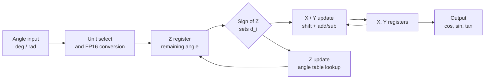

# CORDIC Hardware Implementation

A gate-level hardware implementation of the **CORDIC (COordinate Rotation DIgital Computer)** algorithm, built from scratch in **Logisim**.

Given an angle in **degrees or radians**, the circuit computes **sine, cosine and tangent** using an iterative CORDIC datapath with **IEEE 754 half-precision (FP16)** arithmetic. No software trigonometric functions are used to produce the results.


---

## Table of Contents

- [Overview](#overview)
- [Features](#features)
- [What is CORDIC?](#what-is-cordic)
- [How It Works](#how-it-works)
- [Hardware Implementation](#hardware-implementation)
- [Floating-Point Representation](#floating-point-representation)
- [Limitations](#limitations)
- [Future Work](#future-work)
- [Applications of CORDIC](#applications-of-cordic)
- [Author](#author)

---

## Overview

The goal of this project was to understand how a mathematical algorithm can be turned into a working digital hardware system. It combines three things:

1. Understanding how CORDIC works mathematically
2. Building a working sine / cosine / tangent calculator
3. Applying digital design concepts to implement the algorithm in Logisim

The entire circuit was designed from scratch.

## Features

| Feature | Details |
| --- | --- |
| Outputs | sin θ, cos θ, tan θ |
| Input angle range | 0° to 90° (0 to π/2 rad) |
| Input units | Degrees or radians |
| Iterations | Up to 8 |
| Number format | IEEE 754 half-precision (FP16) |
| Multiplier-free rotation | Shift-and-add only |
| Tool | Logisim |

## What is CORDIC?

CORDIC is an iterative algorithm for evaluating mathematical functions using only simple hardware operations:

- Addition and subtraction
- Bit shifting
- Comparison
- Lookup tables

This makes it well suited to digital hardware that cannot afford dedicated multipliers.

## How It Works

CORDIC repeatedly rotates a vector by a fixed set of decreasing angles until the remaining angle is driven toward zero.

The state variables are:

- **X**: horizontal component of the vector
- **Y**: vertical component of the vector
- **Z**: remaining angle

At each iteration `i`:

```text
x[i+1] = x[i] - d[i] · y[i] · 2^(-i)
y[i+1] = y[i] + d[i] · x[i] · 2^(-i)
z[i+1] = z[i] - d[i] · atan(2^(-i))
```

where `d[i] = +1` if `z[i] >= 0`, otherwise `d[i] = -1`, so each step rotates toward the target angle.

### Rotation matrix form

The X and Y updates can be written as a rotation matrix:

```text
| x[i+1] |   |  1             -d[i]·2^(-i) |   | x[i] |
|        | = |                             | · |      |
| y[i+1] |   |  d[i]·2^(-i)    1           |   | y[i] |
```

Because the off-diagonal terms are powers of two, the multiplications reduce to **bit shifts** (in this FP16 design, an exponent adjustment).

### Angle table

The rotation angle for each iteration comes from a predefined lookup table of `atan(2^-i)`:

| i | 2^-i | atan(2^-i) (degrees) | atan(2^-i) (radians) |
| :-: | :-: | :-: | :-: |
| 0 | 1 | 45.000° | 0.7854 |
| 1 | 0.5 | 26.565° | 0.4636 |
| 2 | 0.25 | 14.036° | 0.2450 |
| 3 | 0.125 | 7.125° | 0.1244 |
| 4 | 0.0625 | 3.576° | 0.0624 |
| 5 | 0.03125 | 1.790° | 0.0312 |
| 6 | 0.015625 | 0.895° | 0.0156 |
| 7 | 0.0078125 | 0.448° | 0.0078 |

### Gain compensation

Each micro-rotation also scales the vector by `sqrt(1 + 2^(-2i))`. The cumulative gain over `n` iterations is a constant, so it is compensated by starting from a pre-scaled vector:

```text
K = product for i = 0 .. n-1 of  1 / sqrt(1 + 2^(-2i))   ≈ 0.6073
```

Initial conditions:

```text
x0 = K
y0 = 0
z0 = θ   (the input angle)
```

After the final iteration:

```text
x_n ≈ cos θ
y_n ≈ sin θ
tan θ = sin θ / cos θ
```

### Dataflow



## Hardware Implementation

The complete design is implemented at the digital-logic level in Logisim. The circuit contains:

- Input angle selection
- Degree / radian handling
- CORDIC iteration control
- X, Y and Z datapaths
- FP16 arithmetic
- Register-based storage
- Multiplexing
- Comparators
- Adders / subtractors
- CORDIC angle lookup table
- Gain compensation
- Output calculation

## Floating-Point Representation

All internal values use **IEEE 754 half-precision (FP16)**:

```text
| Sign | Exponent | Fraction (Mantissa) |
|  1b  |    5b    |        10b          |
```

```text
value = (-1)^s × 2^(e - 15) × (1 + f / 1024)
```

- Exponent bias: 15
- Significand precision: 11 bits (10 stored + 1 implicit), roughly 3 decimal digits
- Multiplication by `2^-i` in the X/Y update only needs an exponent adjustment


## Limitations

- Input range is limited to **0° to 90°** (first quadrant only)
- Maximum of **8 iterations**, so the residual angle error is bounded by roughly `atan(2^-7)` ≈ 0.45°
- FP16 precision limits the achievable output accuracy to about 3 decimal digits

## Future Work

- Extend the input range to all four quadrants via quadrant folding
- Increase the iteration count for higher accuracy
- Add vectoring mode (arctan and magnitude)
- Add hyperbolic mode (sinh, cosh, exp, ln)
- Port the design to Verilog / VHDL for FPGA synthesis

## Applications of CORDIC

- Digital signal processing
- FPGA and ASIC designs
- Radar and communication systems
- Navigation systems
- Robotics
- Computer graphics
- Coordinate transformations

## Author

**Aum Mehta**

---

If you find this project useful, consider giving it a star.
